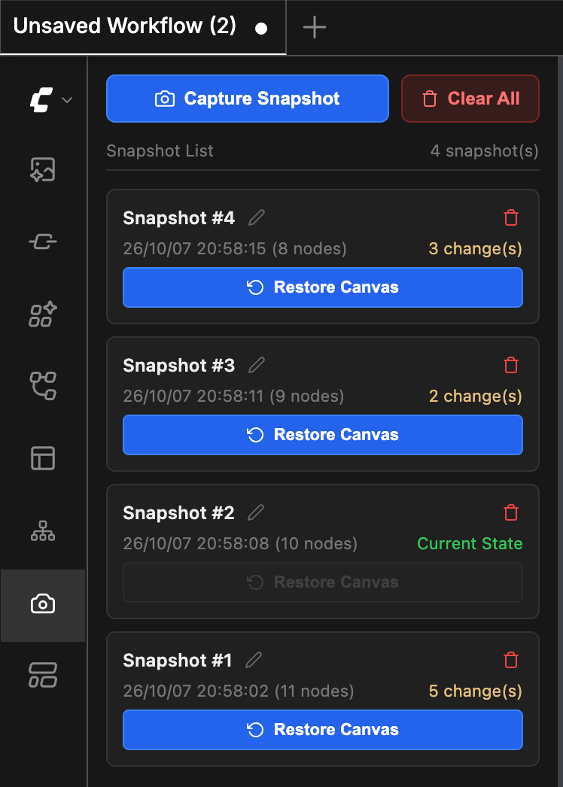

# ComfyUI-Canvas-Snapshots

Save multiple snapshots for each workflow tab in ComfyUI and switch between them instantly.

## Preview



## Installation

#### Install the node:
```bash
cd ComfyUI/custom_nodes
git clone https://github.com/lihaoyun6/ComfyUI-Canvas-Snapshots.git
```

## Usage

- After installing, click the new "camera" icon in the ComfyUI toolbar to open the Snapshot Manager.
- Click the <kbd>Capture Snapshot</kbd> button to capture the current canvas state and return to it at any time.
- Each tab has its own independent snapshot storage. Snapshots will be cleared when the tab is closed.

## Credits

- [ComfyUI](https://github.com/comfyanonymous/ComfyUI) @comfyanonymous
